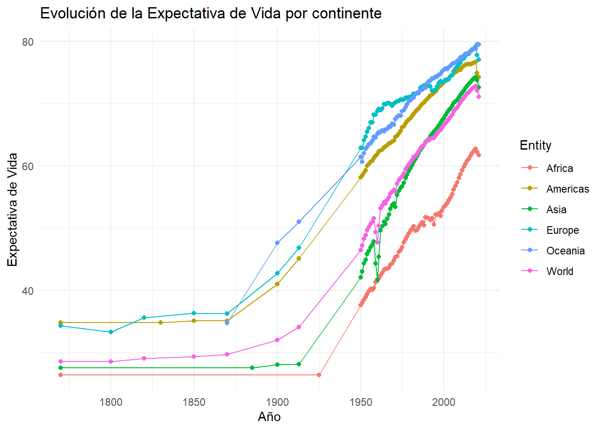
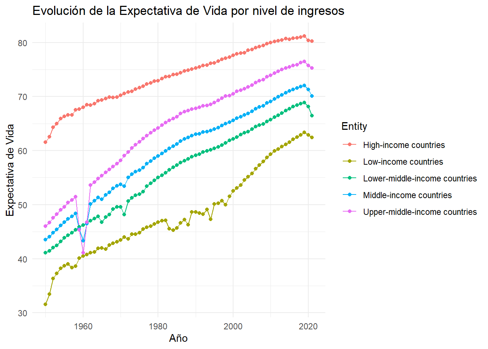
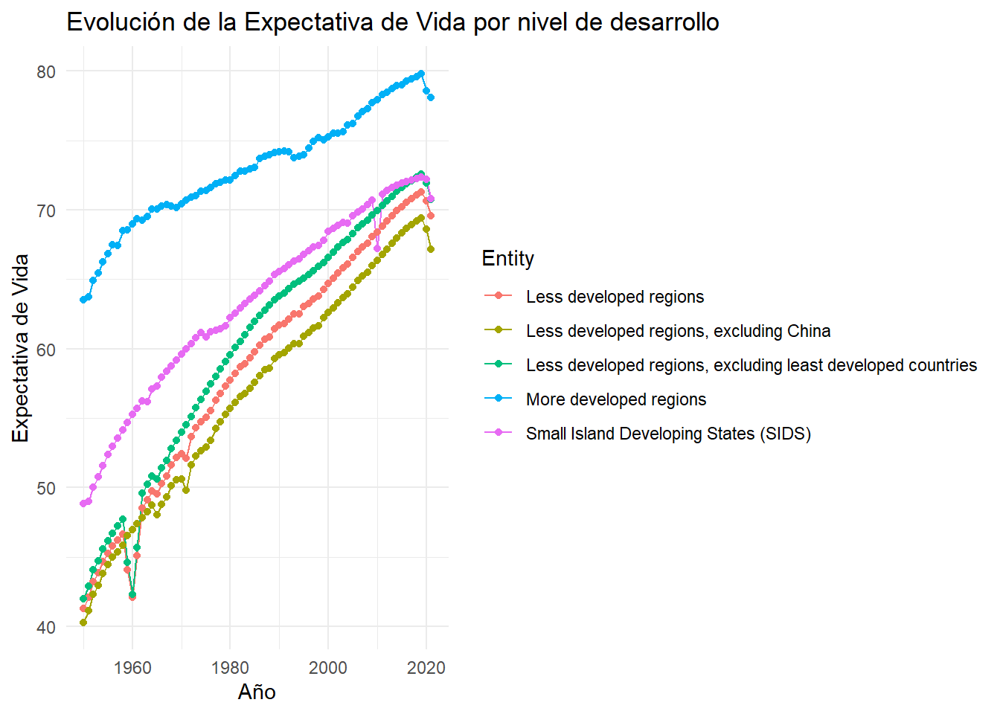
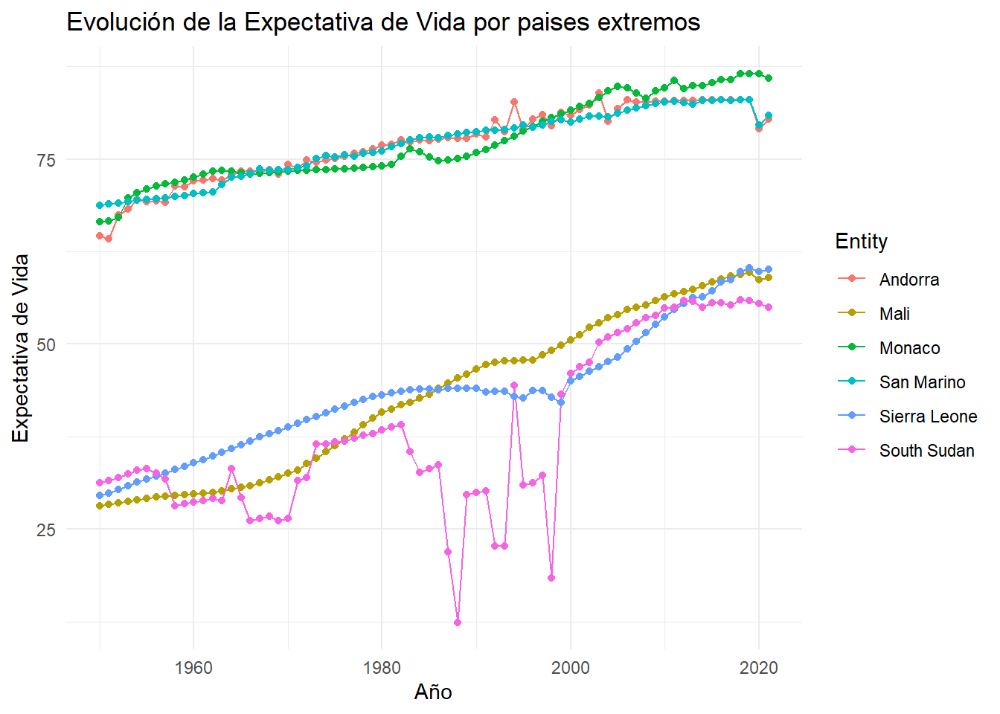
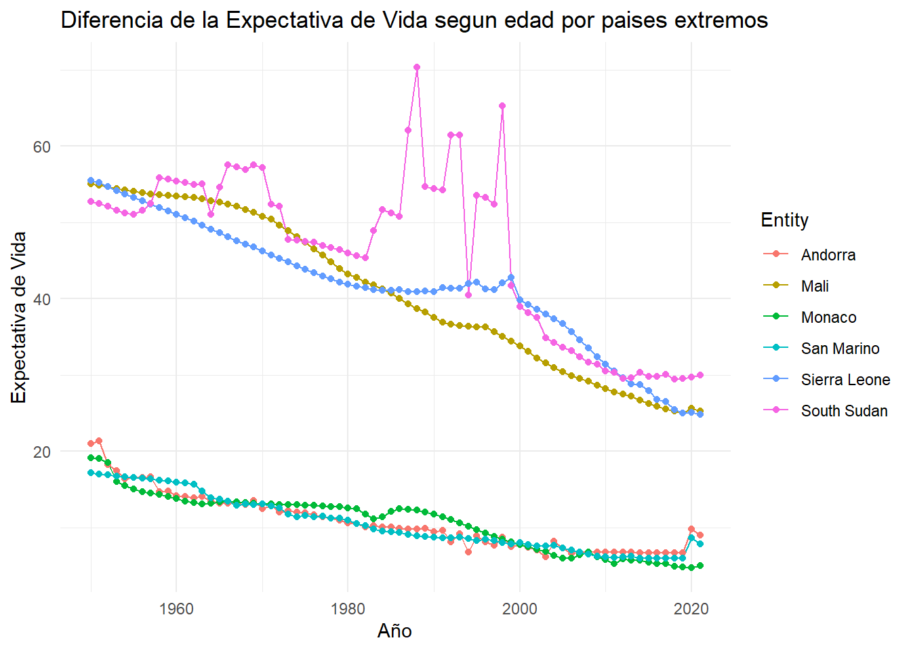

https://takticflow.quarto.pub/lifeexpectancy/

# Life Expectancy

El siguiente código toma un dataset provisto por Tidy Tuesday que brinda información sobre la expectativa de vida anual de cada pais e intenta responder las siguientes preguntas:

1- Cuáles son los 3 paises que en promedio tuvieron mayor/menor expectativa de vida cada año?

2- Cuáles son los paises que lideraron en cada año con mayor/menor expectativa de vida?

## Librerias
Utilice las siguientes librerias:"tidytuesdayR", "DBI", "RSQLite","tidyverse","summarytools","datos","shiny".
## Descarga de los siguientes datasets
tuesdata <- tidytuesdayR::tt_load("2023-12-05")
life_expectancy <- tuesdata$life_expectancy
life_expectancy_different_ages <- tuesdata$life_expectancy_different_ages

## Conexión ficticia a una base de datos ficticia
con <- dbConnect(RSQLite::SQLite(), dbname = ":memory:")

## Crear tablas
dbWriteTable(con, "life", life_expectancy)
dbWriteTable(con, "life_ages", life_expectancy_different_ages)

## Expectativa de vida por continente

## Expectativa de vida por nivel de ingresos

## Expectativa de vida por nivel de desarrollo

## Paises extremos
Paises extremos son los 3 paises que en promedio tuvieron mayor/menor expectativa de vida cada año.

## Expectativa de vida segun edad
Se compara la expectativa de vida al nacer versus la expectativa de vida al tener 80 años.

## Mejor performance
Cual fue el pais que tuvo mejor evolucion de su expectativa de vida?

Common Table Expression (CTE) - RankedLifeExpectancy se obtienen los siguientes datos de data:

Mediante la funcion de ventana LAG() se obtiene PrevYearLifeExpectancy, particionando los datos por Entity.

La diferencia entre el año actual y el anterior es ChangeInLifeExpectancy.

Consulta principal: Selecciona el MaxIncreaseInLifeExpectancy de RankedLifeExpectancy.
